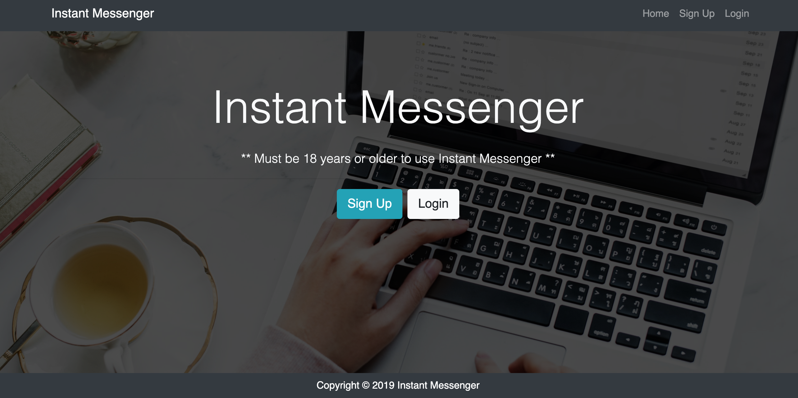

# MERN Instant Messenger

Instant Messenger is a bi-directional chatroom that allows two registered users to communicate with eachother in real time.

Frameworks Used: React.js, Node.js, Express.js

Databases Used: Mongo DB

Modules: Socket.io, Passport, Bcrypt

Deployed Link: https://mern-instant-messenger.herokuapp.com/

## Screenshots

Homepage

{ width=50% }

Registration

{ width=50% }

Sign-in

{ width=50% }

Chatroom

{ width=50% }